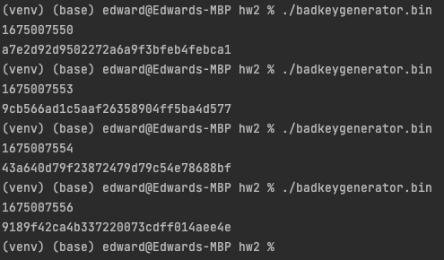
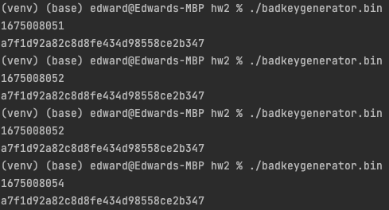
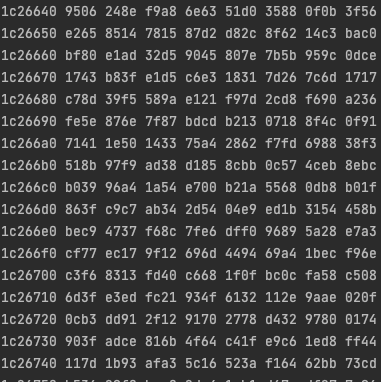
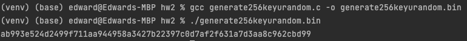

# COSC 5360 Homework Assignment 2

---
### Author: Edward Ward III
### Submitted: Sunday, 29 January 2023

## Task 1

---

Compiled and executed the author's `badkeygenerator.c` file.

```C
#include <stdio.h>
#include <stdlib.h>
#include <time.h>

#define KEYSIZE 16

int main()
{
    int i;
    char key[KEYSIZE];

    printf("%lld\n", (long long) time(NULL));
    srand(time(NULL));

    for (i = 0; i < KEYSIZE; i++)
    {
        key[i] = rand()%256;
        printf("%.2x", (unsigned char)key[i]);
    }
    printf("\n");
}
```

```Bash
gcc badkeygenerator.c -o badkeygenerator.bin
./badkeygenerator.bin
```

Executed multiple time and as suspected, the generated key is different with each execution because the seed is different.



Commenting out `srand`, compiling, and executing, we should expect to see the same key multiple times since the `srand`seed is not changing:

```C
#include <stdio.h>
#include <stdlib.h>
#include <time.h>

#define KEYSIZE 16

int main()
{
    int i;
    char key[KEYSIZE];

    printf("%lld\n", (long long) time(NULL));
    // srand(time(NULL));

    for (i = 0; i < KEYSIZE; i++)
    {
        key[i] = rand()%256;
        printf("%.2x", (unsigned char)key[i]);
    }
    printf("\n");
}
```

```Bash
gcc badkeygenerator.c -o badkeygenerator.bin
./badkeygenerator.bin
```



## Task 2 - Guessing the Key

---
The saved file's epoch `2018-04-17 23:08:49` is `1524006529`. Since we assume the key was generated within the previous two hours of the file being saved, we need keys for every second between `2018-04-17 21:08:49` and the saved file's epoch.

File saved:
```Bash
date -d "2018-04-17 23:08:49" +%s
1524006529
```

Start search:
```Bash
date -d "2018-04-17 21:08:49" +%s
1523999329
```

I modified the author's key generation file to generate keys for every second between when we should start our search and when the file was saved.

```C
#include <stdio.h>
#include <stdlib.h>
#include <time.h>

#define KEYSIZE 16

int main()
{
    int i;
    char key[KEYSIZE];

    // generate key for each second for the two hours prior to when the file
    // was saved and output the results into a key file
    for (time_t t = 1524006529 - 60 * 60 * 2; t < 1524006529; t++)
    {
        srand(t);

        for (i = 0; i < KEYSIZE; i++)
        {
            key[i] = rand()%256;
            printf("%.2x", (unsigned char)key[i]);
        }
        printf("\n");
    }
}
```

Compiling new bad key generator `modbadkeygenerator.c`, executing, and exporting to key file:

```Bash
gcc modbadkeygenerator.c -o modbadkeygenerator.bin
./modbadkeygenerator.bin > keys.txt
```

Checking `keys.txt` to verify the keys were exported properly:
```Bash
head -10 keys.txt
8dfa318cb2fbcaf11635475163586d90
678e3799dbdda8d33a9546e2f251b537
4dd733c6bc3d355ca2f90c4811d2960c
da2e54915f7a4b09b0b72efd41eb51c5
d2d785ab9fd5aa891c3e354e66ef73d8
7c447867b364d68193447f63c89ff69a
cb2f5a825bce6c2a30c02f935abefbe0
c9f823aa903991a6767c1b8d28923881
fb7cea57e9285240d7fa98431aef9896
0a298a7495904df832004cc934bd8bff
```

Brute force to crack the key:

```Python
from Crypto.Cipher import AES

pt = bytearray.fromhex('255044462d312e350a25d0d4c5d80a34')
ct = bytearray.fromhex('d06bf9d0dab8e8ef880660d2af65aa82')
iv = bytearray.fromhex('09080706050403020100A2B2C2D2E2F2')

with open('keys.txt') as f:
    keys = f.readlines()

for k in keys:
    k = k.strip('\n')  # remove new line character generated by output
    key = bytearray.fromhex(k)
    cipher = AES.new(key, AES.MODE_CBC, iv=iv)
    new_ct = cipher.encrypt(pt)
    if new_ct == ct:
        print('Found secret key: {}')
        exit(0)

print('No key found')
exit(1)
```

The first attempt using the save file epoch came up empty:

```Bash
No key found
```

Comparing the author's example:

```Bash
date -d "2018-04-15 15:00:00" +%s
1523818800
```
I noticed the same command produced a different result `14400` seconds behind the author's example:

```Bash
date -d "2018-04-15 15:00:00" +%s
1523804400
```

I adjusted the file's save epoch by four hours as a result:

```Bash
date -d "2018-04-18 03:08:49" +%s 
1524020929
```

Changing the file key generator file to reflect the new epoch:
```C
#include <stdio.h>
#include <stdlib.h>
#include <time.h>

#define KEYSIZE 16

int main()
{
    int i;
    char key[KEYSIZE];

    // generate key for each second for the two hours prior to when the file
    // was saved and output the results into a key file
    for (time_t t = 1524020929 - 60 * 60 * 2; t < 1524020929; t++)
    {
        srand(t);

        for (i = 0; i < KEYSIZE; i++)
        {
            key[i] = rand()%256;
            printf("%.2x", (unsigned char)key[i]);
        }
        printf("\n");
    }
}
```
Generating a new key file:
```Bash
gcc modbadkeygenerator.c -o modbadkeygenerator.bin
./modbadkeygenerator.bin > keys.txt
```
Brute force the key once again:

```Bash
python3.8 crackthekey.py
Found secret key: 95fa2030e73ed3f8da761b4eb805dfd7
```

## Task 3 - Measure the Entropy of Kernel

---
Observe the current entropy available:

```Bash
cat /proc/sys/kernel/random/entropy_avail
256
```

Watch the entropy available while moving the mouse, typing, visiting a website:

```Bash
watch -n .1 cat /proc/sys/kernel/random/entropy_avail

Every 0.1s: cat /proc/sys/kernel/random/...  cosc-5360: Sun Jan 29 18:12:48 2023

256
```

Moving the mouse or typing on the keyboard seems to generate entropy faster than visiting a website.

## Task 4 - Get Pseudo Random Numbers from /dev/random

----
Observe the random pool. Significant increase is randomness rate when I move the mouse.

Terminal 1:
```Bash
cat /dev/random | hexdump

02636b0 9b63 2b31 1017 c489 6369 e177 84fb e782
02636c0 4e3d f9c5 6cb0 2b29 5698 7aaf 70e4 7299
02636d0 ac0d 6ec9 2a31 24ae cf28 3c86 e7ad fc37
02636e0 1d25 4aa1 4417 84a3 4edf 49b6 fe98 9768
02636f0 ef5b a1d4 33d0 2b00 7fc9 51f6 051e 2fea
0263700 b41f 6f27 e055 65a1 ce23 5fb6 51ac dd3e
0263710 4de1 61a7 ab67 1f88 b5de 6916 562c 6ee0
0263720 3f2e 601b 0f08 71f8 e51f 6d52 e12b 2515
0263730 1f98 64de 4002 a7a7 fa7f 4d8f ec43 45d2
0263740 abef 2d43 eee4 91fa 30a0 d418 fcdc 8199
0263750 60a3 7494 24e1 c2d4 70f3 d8a7 9cf9 45db
0263760 7349 1c38 e5bf ebc8 ccb0 f4f0 dd4b 509a
0263770 2adb 835d 0997 e07d cb20 facf 98f5 4e94
0263780 9caf eb6a 95e9 3b30 ce6a e572 fd61 b128
0263790 cf4d daee e12e 97ea 5b4a 0bda 747c 621f
02637a0 5ad1 5534 e995 5c13 ded3 1653 2fe7 055e
02637b0 c5a5 9393 8070 277f 0a2f 718d 8dab db50
```

Terminal 2:
```Bash
watch -n .1 cat /proc/sys/kernel/random/entropy_avail
```

Question: If a server uses `/dev/random` to generate the random session key with a client. Please describe how you can launch a Denial-Of-Service (DOS) attack on such a server.

Answer: Given `/dev/random` is a blocking device, you can launch a denial-of-service (DOS) attack on the server by requesting session keys faster than the server can generate the entropy needed to generate keys, preventing legitimate sessions from connecting.

## Task 5 - Get Random Numbers from `/dev/urandom`

---
Observing `/dev/urandom`, it does not appear moving the mouse has any significant impact on how fast it will generate pseudo-random numbers.

```Bash
cat /dev/urandom | hexdump
```


Examining the entropy of `/dev/urandom` using `ent`:

```Bash
head -c 1M /dev/urandom > output.bin
ent output.bin

Entropy = 7.999812 bits per byte.

Optimum compression would reduce the size
of this 1048576 byte file by 0 percent.

Chi square distribution for 1048576 samples is 272.84, and randomly
would exceed this value 21.14 percent of the times.

Arithmetic mean value of data bytes is 127.5033 (127.5 = random).
Monte Carlo value for Pi is 3.136837528 (error 0.15 percent).
Serial correlation coefficient is -0.000361 (totally uncorrelated = 0.0).
```
Examining the entropy of `/dev/random` using `ent`:

```Bash
head -c 1M /dev/random > output.bin
ent output.bin

Entropy = 7.999826 bits per byte.

Optimum compression would reduce the size
of this 1048576 byte file by 0 percent.

Chi square distribution for 1048576 samples is 252.87, and randomly
would exceed this value 52.59 percent of the times.

Arithmetic mean value of data bytes is 127.4924 (127.5 = random).
Monte Carlo value for Pi is 3.145420629 (error 0.12 percent).
Serial correlation coefficient is 0.000495 (totally uncorrelated = 0.0).
```

The two appear almost identical in quality. Here is the C program used to generate a 256-bit encryption key using `/dev/urandom`:

```C
#include <stdio.h>
#include <stdlib.h>

#define LEN 32 // 256-bits

int main(){
    unsigned char *key = (unsigned char *) malloc(sizeof(unsigned char)*LEN);
    FILE* random = fopen("/dev/urandom", "r");
    fread(key, sizeof(unsigned char)*LEN, 1, random);
    fclose(random);
    for (int i = 0; i < LEN; i++)
        printf("%.2x", key[i]);
    printf("\n");
}
```
Compile and execute to generate 256-bit key from `/dev/urandom`.
```Bash
gcc generate256keyurandom.c -o generate256keyurandom.bin
./generate256keyurandom.bin
ab993e524d2499f711aa944958a3427b22397c0d7af2f631a7d3aa8c962cbd99
```
