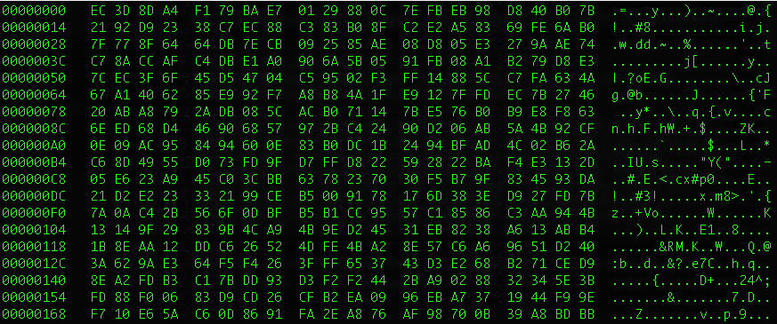
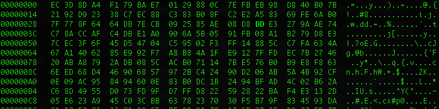

# Task 2: Encryption using different ciphers and modes

First, I created a `plain.txt` file for the exercise and typed in a super secret message.

> This is a super secret message. If the contents of this super secret message were to ever get out, untold destruction, devastation, and global famine would occur in about 30 seconds or you might miss lunch. There is such a range of possibilities, so make sure no one ever sees this super, double top secret message.

I checked `man openssl-enc` to view the various `openssl` encryption modes available (full list abbreviated to `AES` and `DES` modes):

```
aes-[128|192|256]-cbc  128/192/256 bit AES in CBC mode
aes[128|192|256]       Alias for aes-[128|192|256]-cbc
aes-[128|192|256]-cfb  128/192/256 bit AES in 128 bit CFB mode
aes-[128|192|256]-cfb1 128/192/256 bit AES in 1 bit CFB mode
aes-[128|192|256]-cfb8 128/192/256 bit AES in 8 bit CFB mode
aes-[128|192|256]-ctr  128/192/256 bit AES in CTR mode
aes-[128|192|256]-ecb  128/192/256 bit AES in ECB mode
aes-[128|192|256]-ofb  128/192/256 bit AES in OFB mode

des-cbc            DES in CBC mode
des                Alias for des-cbc
des-cfb            DES in CFB mode
des-ofb            DES in OFB mode
des-ecb            DES in ECB mode

des-ede-cbc        Two key triple DES EDE in CBC mode
des-ede            Two key triple DES EDE in ECB mode
des-ede-cfb        Two key triple DES EDE in CFB mode
des-ede-ofb        Two key triple DES EDE in OFB mode

des-ede3-cbc       Three key triple DES EDE in CBC mode
des-ede3           Three key triple DES EDE in ECB mode
des3               Alias for des-ede3-cbc
des-ede3-cfb       Three key triple DES EDE CFB mode
des-ede3-ofb       Three key triple DES EDE in OFB mode
```

I picked `aes-128-ecb`, `aes-128-cbc`, and `aes-128-ctr` due to the author's 128-bit key `K` and 64-bit initialization vector `iv`. 

### First Encryption `aes-128-ecb`
I executed the following. Note `iv` is not used by `ecb`:
```bash
openssl enc -aes-128-ecb -e  -in plain.txt -out cipher1.bin \
              -K  00112233445566778889aabbccddeeff
```
Output
```bash
hexdump -C cipher1.bin
00000000  ff 8b e0 2c ba 80 2c 9a  38 40 8b ee 79 27 21 41  |...,..,.8@..y'!A|
00000010  31 54 dc c5 ba c3 04 c8  fb 0f 11 ac 69 23 1d 6a  |1T..........i#.j|
00000020  85 d9 b1 8f 9c fc 38 b5  54 64 82 b0 88 8a f5 58  |......8.Td.....X|
00000030  c5 72 a7 04 b8 4f f4 a7  02 0c 04 a3 41 79 59 12  |.r...O......AyY.|
00000040  7c 3c 1d 25 47 04 20 37  8a 5d 9a fd 1d ff 99 41  ||<.%G. 7.].....A|
00000050  e7 98 e9 1d ca dd ab 0c  76 3b e4 0e d7 60 3d 68  |........v;...`=h|
00000060  82 76 c8 97 b4 21 c8 cc  37 c4 b5 38 6b cb 99 c9  |.v...!..7..8k...|
00000070  3a b4 17 5d 62 29 ad 6a  4f e4 97 29 0e 98 02 da  |:..]b).jO..)....|
00000080  a7 dd ed 6d c0 f3 84 2a  e6 ff a0 18 46 5f 49 1b  |...m...*....F_I.|
00000090  9f 7d f7 f6 55 12 b3 99  96 61 a6 77 dc 20 44 f6  |.}..U....a.w. D.|
000000a0  ad 3b 28 95 72 86 9c 4a  53 43 1e e7 fa 0c 60 77  |.;(.r..JSC....`w|
000000b0  df ac 4a 0b 32 01 f8 08  7f cc 84 8d 6f 2e fb 6e  |..J.2.......o..n|
000000c0  34 a3 76 6f 43 de a9 af  2a a6 79 65 6d a7 c6 66  |4.voC...*.yem..f|
000000d0  28 d9 a5 96 d9 32 03 70  ab 97 3b d9 c9 15 0c 94  |(....2.p..;.....|
000000e0  1f dc b4 19 39 f7 56 ec  d5 4b 9e 57 d2 a8 2f a5  |....9.V..K.W../.|
000000f0  7c 7d 99 8d d4 58 74 24  24 76 74 b9 2c 19 2f ff  ||}...Xt$$vt.,./.|
00000100  54 c1 11 0b 91 bb 17 26  72 fd 87 55 ab bc 90 ee  |T......&r..U....|
00000110  4c 51 dc 0e b6 73 55 c9  68 9f 5c 43 06 72 dd 4a  |LQ...sU.h.\C.r.J|
00000120  b9 4f fd a1 f8 75 6b 62  23 c1 66 51 14 c3 b4 e7  |.O...ukb#.fQ....|
00000130  b1 ab f7 0b 34 c1 98 8c  bf be 5e 0b b5 4f 56 a0  |....4.....^..OV.|
00000140
```
Decrypt just to make sure. Piped the decrypted text into `diff` and compared to `plain.txt` to ensure there were no differences. The `-` in the `diff` command represents `STDIN`. There were no differences.
```bash
openssl enc -d -aes-128-ecb -in cipher1.bin \
  -K 00112233445566778889aabbccddeeff | diff plain.txt -
```

### Second Encryption `aes-128-cbc`

I executed the following command. I needed to pad the provided initialization vector `iv` by 64-bits this attempt since it is a `cbc` or cipher block chain and the `iv` and key `K` need to be 128-bits.

```bash
openssl enc -aes-128-cbc -e  -in plain.txt -out cipher2.bin \
              -K  00112233445566778889aabbccddeeff \
              -iv 01020304050607080102030405060708
```
Output
```bash
hexdump -C cipber2.bin
00000000  eb f1 ae 66 b3 a9 47 4e  30 f7 e1 27 eb 44 98 6e  |...f..GN0..'.D.n|
00000010  27 c7 1c d6 da 2a 60 b8  2c b2 c7 cc 64 9b 01 5a  |'....*`.,...d..Z|
00000020  ab fd e5 57 ad 38 85 02  3e 77 15 fe 7b c2 82 71  |...W.8..>w..{..q|
00000030  b3 c1 76 e8 43 2a e1 29  be c4 0c 2d 7c 09 96 92  |..v.C*.)...-|...|
00000040  38 04 d7 ee 26 40 f4 f4  e9 02 5a 68 ef 38 b2 cc  |8...&@....Zh.8..|
00000050  13 05 4b 78 01 5f 77 23  50 50 42 6f 1d 00 bc 8e  |..Kx._w#PPBo....|
00000060  b2 59 09 ae 7c c7 8c a7  e4 4e 3f 49 b5 ed 85 e1  |.Y..|....N?I....|
00000070  43 70 5f 45 46 77 f1 5a  a8 74 51 a2 9a 09 87 be  |Cp_EFw.Z.tQ.....|
00000080  cb c0 72 fa 18 49 6d fa  18 92 4d eb 72 19 7e 7e  |..r..Im...M.r.~~|
00000090  46 04 98 14 f5 7d 34 4c  90 f9 0a e8 89 34 99 da  |F....}4L.....4..|
000000a0  83 cc 37 96 f7 e5 7f cb  29 59 a1 db b7 66 24 a8  |..7.....)Y...f$.|
000000b0  78 9e 0b f9 13 43 60 5f  68 a3 98 53 4d 4c cd 96  |x....C`_h..SML..|
000000c0  c6 9a 84 a3 82 d7 41 b5  f5 e9 61 ba 02 4c f4 39  |......A...a..L.9|
000000d0  72 2f 37 ca 1a d4 82 2d  04 00 fa 9e 94 b7 e0 1b  |r/7....-........|
000000e0  69 f9 79 71 a0 e8 a0 05  1b 5a a7 04 f6 07 b7 7d  |i.yq.....Z.....}|
000000f0  b2 b6 7e 1d 5b 84 93 0e  2b b2 5b 44 5b 3c 06 74  |..~.[...+.[D[<.t|
00000100  2c 4f 42 bb 9a b2 7f fb  0e 77 da e8 35 9a 08 59  |,OB......w..5..Y|
00000110  b0 a3 52 e2 d3 ec 45 33  bc 38 ac 04 24 4e b0 25  |..R...E3.8..$N.%|
00000120  52 86 81 04 c3 12 2f 10  10 bd a8 ab e9 27 38 13  |R...../......'8.|
00000130  ad dc 0b da 8b 75 90 6a  86 61 84 1a 12 1b 70 93  |.....u.j.a....p.|
00000140
```
You can compare the `ebc` and `cbc` cipher and see the differences. Decrypt just to make sure. Piped the decrypted text into `diff` and compared to `plain.txt` to ensure there were no differences. The `-` in the `diff` command represents `STDIN`. Again, there were no differences.
```bash
openssl enc -d -aes-128-cbc -in cipher2.bin \
  -K 00112233445566778889aabbccddeeff \
  -iv 01020304050607080102030405060708 | diff plain.txt -
```

### Third Encryption `aes-128-ctr`

I executed the following command using the author's 128-bit key `K` and the padded 128-bit initialization vector `iv` I used in the last example `01020304050607080102030405060708`.

```bash
openssl enc -aes-128-ctr -e  -in plain.txt -out cipher3.bin \
              -K  00112233445566778889aabbccddeeff \
              -iv 01020304050607080102030405060708
```
Output
```bash
hexdump -C cipher3.bin
00000000  06 3c 1f d3 88 3d 03 6b  38 82 96 16 79 11 57 77  |.<...=.k8...y.Ww|
00000010  d5 03 84 18 44 b2 fc c6  f0 01 76 11 36 cb b5 ba  |....D.....v.6...|
00000020  f4 53 f0 3a e0 5d 2b 1a  68 62 4e 47 bb 91 4e 87  |.S.:.]+.hbNG..N.|
00000030  5a 5a ed 6d bd 02 66 3f  c3 f6 39 7b 4d d9 4f 47  |ZZ.m..f?..9{M.OG|
00000040  c0 60 2c 51 2e c3 8f 75  fa d4 11 b8 9a 3a f7 a9  |.`,Q...u.....:..|
00000050  61 ac 06 94 95 c1 df 65  65 8b 73 e4 bf d5 18 ce  |a......ee.s.....|
00000060  5a 3b 3a 9b 4b 05 fb 55  f7 ff 9a 0e 8f 9c 47 e5  |Z;:.K..U......G.|
00000070  f5 af 41 2a 03 86 c7 f0  f9 79 25 fa fb 23 4a 36  |..A*.....y%..#J6|
00000080  91 d3 e9 0b 81 77 14 7a  6a b7 e8 0c da 09 ef ad  |.....w.zj.......|
00000090  bd a0 1d a2 ab 01 af 5d  f7 23 73 d5 b8 9b 52 24  |.......].#s...R$|
000000a0  e5 a9 5f 5d 0e 37 dd fc  ff 2f a1 3a a6 86 9e 58  |.._].7.../.:...X|
000000b0  22 7c b7 8f 31 fe 84 f0  11 79 5b fa 29 7c 84 18  |"|..1....y[.)|..|
000000c0  44 9e 55 09 e5 0f a8 86  54 85 a8 9a 7b 77 b8 b5  |D.U.....T...{w..|
000000d0  1d 34 3c fa 11 58 9f 80  bd bb 64 f6 49 cb 9c 03  |.4<..X....d.I...|
000000e0  6c f5 09 81 89 6d 11 47  ee 5b 35 eb 04 2a d0 f6  |l....m.G.[5..*..|
000000f0  67 1b d9 e5 26 fd 61 c5  c6 c6 08 ad b8 d1 41 b5  |g...&.a.......A.|
00000100  fc 0d dd cd 84 32 05 7d  26 0d 67 06 a7 a0 26 d4  |.....2.}&.g...&.|
00000110  c5 11 10 08 4c cf ca 7a  df 72 35 e1 21 b4 34 3b  |....L..z.r5.!.4;|
00000120  b1 33 08 67 23 7f f1 a0  04 5f 1d 71 77 0c 17 d5  |.3.g#...._.qw...|
00000130  74 c5 25 e9 fe 4c 29 69  0c 41 ca a3              |t.%..L)i.A..|
0000013c
```
As expected, completely different than the two previous modes. Decrypt just to make sure. Piped the decrypted text into `diff` and compared to `plain.txt` to ensure there were no differences. The `-` in the `diff` command represents `STDIN`. Again, there were no differences.

```bash
openssl enc -d -aes-128-ctr -in cipher3.bin \
  -K 00112233445566778889aabbccddeeff \
  -iv 01020304050607080102030405060708 | diff plain.txt -
```
# Task 3: Encryption Mode ECB vs. CBC

Here is the original bitmap image we want to encrypt using `ECB` and `CBC`. Knowing what we've been taught already about `ECB` vs. `CBC`, I expect the shapes will be visible using `ECB` since each pixel will be encrypted the same way and complete random using `CBC`.


To separate the `BMP` header from `pic_original.bmp` and partition the header and body, I used the following:

```bash
head -c 54 pic_original.bmp > bmp_header.bin
```

I wanted to view the header out of curiosity

```bash
hexdump -C bmp_header.bin
00000000  42 4d 8e d2 02 00 00 00  00 00 36 00 00 00 28 00  |BM........6...(.|
00000010  00 00 cc 01 00 00 86 00  00 00 01 00 18 00 00 00  |................|
00000020  00 00 58 d2 02 00 00 00  00 00 00 00 00 00 00 00  |..X.............|
00000030  00 00 00 00 00 00                                 |......|
00000036
```
I then encrypted the original picture file `pic_original.bmp` using `ecb` and `cbc` and replaced the first 54-bytes of the encrypted file with the plaintext `BMP` header. I used the same key `K` and initialization vector (for `cbc`) as above.

```bash
# aes-128-ecb
openssl enc -aes-128-ecb -in pic_original.bmp -out pic_ecb.bin \
  -K 00112233445566778889aabbccddeeff
# aes-128-cbc
openssl enc -aes-128-cbc -in pic_original.bmp -out pic_cbc.bin \
  -K 00112233445566778889aabbccddeeff \
 -iv 01020304050607080102030405060708
 
# reassemble ecb and cbc images
tail -c +55 pic_ecb.bin > body.bin
cat bmp_header.bin body.bin > pic_ecb.bmp
tail -c +55 pic_cbc.bin > body.bin
cat bmp_header.bin body.bin > pic_cbc.bmp
```
Picture encrypted with `ecb`, which you can clearly see the shapes.


Picture encrypted with `cbc` is completely random as expected.


# Task 4: Padding

Create the files necessary to execute the task.

```bash
echo -n "0123456789abcdef" > f16.txt
head -c +5 f16.txt > f5.txt
head -c +10 f16.txt > f10.txt

# Verify files created correctly
wc -c f5.txt f10.txt f16.txt
       5 f5.txt
      10 f10.txt
      16 f16.txt
      31 total
```

Encrypt using `aes-128-[ecb|cbc|cfb|ofb]` and same key `k` and `iv` as required using the above key `K` and initialization vector `iv` as required and the following Bash script, which I would refactor with a loop or two to make it more concise.

```bash
#!/bin/bash
#!/bin/bash

################## ecb ##################
# encrypt
openssl enc -aes-128-ecb -in f5.txt -out f5.bin \
  -K 00112233445566778889aabbccddeeff
openssl enc -aes-128-ecb -in f10.txt -out f10.bin \
  -K 00112233445566778889aabbccddeeff
openssl enc -aes-128-ecb -in f16.txt -out f16.bin \
  -K 00112233445566778889aabbccddeeff

echo 'ECB has the following byte counts for the three files:'
# decrypt and count bytes
openssl enc -aes-128-ecb -d -nopad -in f5.bin \
  -K 00112233445566778889aabbccddeeff | wc -c

openssl enc -aes-128-ecb -d -nopad -in f10.bin \
  -K 00112233445566778889aabbccddeeff | wc -c

openssl enc -aes-128-ecb -d -nopad -in f16.bin \
  -K 00112233445566778889aabbccddeeff | wc -c

################## CBC ##################
# encrypt
openssl enc -aes-128-cbc -in f5.txt -out f5.bin \
  -K 00112233445566778889aabbccddeeff \
  -iv 01020304050607080102030405060708
openssl enc -aes-128-cbc -in f10.txt -out f10.bin \
  -K 00112233445566778889aabbccddeeff \
  -iv 01020304050607080102030405060708
openssl enc -aes-128-cbc -in f16.txt -out f16.bin \
  -K 00112233445566778889aabbccddeeff \
  -iv 01020304050607080102030405060708

echo 'CBC has the following byte counts for the three files:'
# decrypt and count bytes
openssl enc -aes-128-cbc -d -nopad -in f5.bin \
  -K 00112233445566778889aabbccddeeff \
  -iv 01020304050607080102030405060708 | wc -c

openssl enc -aes-128-cbc -d -nopad -in f10.bin \
  -K 00112233445566778889aabbccddeeff \
  -iv 01020304050607080102030405060708 | wc -c

openssl enc -aes-128-cbc -d -nopad -in f16.bin \
  -K 00112233445566778889aabbccddeeff \
   -iv 01020304050607080102030405060708 | wc -c

################## CFB ##################
# encrypt
openssl enc -aes-128-cfb -in f5.txt -out f5.bin \
  -K 00112233445566778889aabbccddeeff \
  -iv 01020304050607080102030405060708
openssl enc -aes-128-cfb -in f10.txt -out f10.bin \
  -K 00112233445566778889aabbccddeeff \
  -iv 01020304050607080102030405060708
openssl enc -aes-128-cfb -in f16.txt -out f16.bin \
  -K 00112233445566778889aabbccddeeff \
  -iv 01020304050607080102030405060708

echo 'CFB has the following byte counts for the three files:'
# decrypt and count bytes
openssl enc -aes-128-cfb -d -nopad -in f5.bin \
  -K 00112233445566778889aabbccddeeff \
  -iv 01020304050607080102030405060708 | wc -c

openssl enc -aes-128-cfb -d -nopad -in f10.bin \
  -K 00112233445566778889aabbccddeeff \
  -iv 01020304050607080102030405060708 | wc -c

openssl enc -aes-128-cfb -d -nopad -in f16.bin \
  -K 00112233445566778889aabbccddeeff \
   -iv 01020304050607080102030405060708 | wc -c

################## OFB ##################
# encrypt
openssl enc -aes-128-ofb -in f5.txt -out f5.bin \
  -K 00112233445566778889aabbccddeeff \
  -iv 01020304050607080102030405060708
openssl enc -aes-128-ofb -in f10.txt -out f10.bin \
  -K 00112233445566778889aabbccddeeff \
  -iv 01020304050607080102030405060708
openssl enc -aes-128-ofb -in f16.txt -out f16.bin \
  -K 00112233445566778889aabbccddeeff \
  -iv 01020304050607080102030405060708

echo 'OFB has the following byte counts for the three files:'
# decrypt and count bytes
openssl enc -aes-128-ofb -d -nopad -in f5.bin \
  -K 00112233445566778889aabbccddeeff \
  -iv 01020304050607080102030405060708 | wc -c

openssl enc -aes-128-ofb -d -nopad -in f10.bin \
  -K 00112233445566778889aabbccddeeff \
  -iv 01020304050607080102030405060708 | wc -c

openssl enc -aes-128-ofb -d -nopad -in f16.bin \
  -K 00112233445566778889aabbccddeeff \
   -iv 01020304050607080102030405060708 | wc -c

rm f5.bin f10.bin f16.bin
```
Outputs

```Bash
ECB has the following byte counts for the three files:
      16
      16
      32
CBC has the following byte counts for the three files:
      16
      16
      32
CFB has the following byte counts for the three files:
       5
      10
      16
OFB has the following byte counts for the three files:
       5
      10
      16
```
### Results
`ECB` and `CBC` pad. `CFB` and `OFB` do not pad.

# Task 5: Error Propagation - Corrupted Cipher Text

I used the deciphered plaintext message `originalmessage.txt` from HW1 as a starting point.

```bash
head -10 originalmessage.txt
THE OSCARS TURN  ON SUNDAY WHICH SEEMS ABOUT RIGHT AFTER THIS LONG STRANGE
AWARDS TRIP THE BAGGER FEELS LIKE A NONAGENARIAN TOO

THE AWARDS RACE WAS BOOKENDED BY THE DEMISE OF HARVEY WEINSTEIN AT ITS OUTSET
AND THE APPARENT IMPLOSION OF HIS FILM COMPANY AT THE END AND IT WAS SHAPED BY
THE EMERGENCE OF METOO TIMES UP BLACKGOWN POLITICS ARMCANDY ACTIVISM AND
A NATIONAL CONVERSATION AS BRIEF AND MAD AS A FEVER DREAM ABOUT WHETHER THERE
OUGHT TO BE A PRESIDENT WINFREY THE SEASON DIDNT JUST SEEM EXTRA LONG IT WAS
EXTRA LONG BECAUSE THE OSCARS WERE MOVED TO THE FIRST WEEKEND IN MARCH TO
AVOID CONFLICTING WITH THE CLOSING CEREMONY OF THE WINTER OLYMPICS THANKS
```

Encrypt the files with the four AES modes `[ecb|cbc|cfb|ofb]` using the same key `K` and initialization vector `iv` above as required.

```bash
#!/bin/bash

# encrypt original message
openssl enc -aes-128-ecb -in originalmessage.txt -out message_ecb.bin \
  -K 00112233445566778889aabbccddeeff
openssl enc -aes-128-cbc -in originalmessage.txt -out message_cbc.bin \
  -K 00112233445566778889aabbccddeeff \
  -iv 01020304050607080102030405060708
openssl enc -aes-128-cfb -in originalmessage.txt -out message_cfb.bin \
  -K 00112233445566778889aabbccddeeff \
  -iv 01020304050607080102030405060708
openssl enc -aes-128-ofb -in originalmessage.txt -out message_ofb.bin \
  -K 00112233445566778889aabbccddeeff \
  -iv 01020304050607080102030405060708
```

I used `hexedit` instead of the `bless` hex editor because I would like to stick with the terminal and avoid GUIs. **I suspect I will see minimal corruption in all four modes and the message will still be completely readable.**

```bash
sudo apt install hexedit
hexedit message_ecb.bin
```


Changed the 55th byte to `DD` in all four binaries. Here's an example of the `ecb` change.



After editing, decrypt each mangled encrypted file using `decryptmanagledmessages.sh`

```bash
#!/bin/bash
openssl enc -aes-128-ecb -d -in message_ecb.bin -out messageout_ecb.txt \
  -K 00112233445566778889aabbccddeeff
openssl enc -aes-128-cbc -d -in message_cbc.bin -out messageout_cbc.txt \
  -K 00112233445566778889aabbccddeeff \
  -iv 01020304050607080102030405060708
openssl enc -aes-128-cfb -d -in message_cfb.bin -out messageout_cfb.txt \
  -K 00112233445566778889aabbccddeeff \
  -iv 01020304050607080102030405060708
openssl enc -aes-128-ofb -d -in message_ofb.bin -out messageout_ofb.txt \
  -K 00112233445566778889aabbccddeeff \
  -iv 01020304050607080102030405060708
```

Compare plaintext with corrupt `ECB`. Only one part of the message is corrupted.

```bash
diff originalmessage.txt messageout_ecb.txt
1c1
< THE OSCARS TURN  ON SUNDAY WHICH SEEMS ABOUT RIGHT AFTER THIS LONG STRANGE
---
> THE OSCARS TURN  ON SUNDAY WHICH SEEMS ABOUT RIG�!��7/L/XV4NG STRANGE

```

Compare plaintext with corrupt `CBC`. Again, only a small part of the message is corrupted.

```bash
diff originalmessage.txt messageout_cbc.txt
1c1
< THE OSCARS TURN  ON SUNDAY WHICH SEEMS ABOUT RIGHT AFTER THIS LONG STRANGE
---
> THE OSCARS TURN  ON SUNDAY WHICH SEEMS ABOUT RIG�TSGЄ
                                                       AҠ��DFuNG STR�NGE
```

Compare plaintext with corrupt `CFB`. Only a small part impacted.

```bash
diff originalmessage.txt messageout_cfb.txt
1,2c1
< THE OSCARS TURN  ON SUNDAY WHICH SEEMS ABOUT RIGHT AFTER THIS LONG STRANGE
< AWARDS TRIP THE BAGGER FEELS LIKE A NONAGENARIAN TOO
---
> THE OSCARS TURN  ON SUNDAY WHICH SEEMS ABOUT RIGHT AFTNR THIS LOi��r3>�u0�Ze�S TRIP THE BAGGER FEELS LIKE A NONAGENARIAN TOO
```

Compare plaintext with corrupt `OFB`. Least difference, only a single character is corrupt.

```bash
diff originalmessage.txt messageout_ofb.txt
1c1
< THE OSCARS TURN  ON SUNDAY WHICH SEEMS ABOUT RIGHT AFTER THIS LONG STRANGE
---
> THE OSCARS TURN  ON SUNDAY WHICH SEEMS ABOUT RIGHT AFTCR THIS LONG STRANGE

```

# Task 6: Initial Vector (IV) and Common Mistakes

## Task 6.1. IV Experiment

Encrypt the same text using (1) two different IVs and (2) the same IV. Please describe your observation, based on which, explain why IV needs to be unique.

```bash
# encrypt using two different ivs
openssl enc -aes-128-cbc -in plain.txt -out iv1diff.bin \
  -K 00112233445566778889aabbccddeeff \
  -iv 01020304050607080102030405060708
openssl enc -aes-128-cbc -in plain.txt -out iv2diff.bin \
  -K 00112233445566778889aabbccddeeff \
  -iv 010203040506070801020304050607aa
```

Examine both encrypted files

```bash
hexdump -C iv1diff.bin | head -5
00000000  eb f1 ae 66 b3 a9 47 4e  30 f7 e1 27 eb 44 98 6e  |...f..GN0..'.D.n|
00000010  27 c7 1c d6 da 2a 60 b8  2c b2 c7 cc 64 9b 01 5a  |'....*`.,...d..Z|
00000020  ab fd e5 57 ad 38 85 02  3e 77 15 fe 7b c2 82 71  |...W.8..>w..{..q|
00000030  b3 c1 76 e8 43 2a e1 29  be c4 0c 2d 7c 09 96 92  |..v.C*.)...-|...|
00000040  38 04 d7 ee 26 40 f4 f4  e9 02 5a 68 ef 38 b2 cc  |8...&@....Zh.8..|

hexdump -C iv2diff.bin | head -5
00000000  63 c9 5d 85 99 dc da fd  68 86 8b 17 e1 16 f5 d0  |c.].....h.......|
00000010  30 b2 eb 74 97 30 d7 6a  ec a1 8d ce 32 09 d6 e1  |0..t.0.j....2...|
00000020  ee 65 4f f6 20 c3 9d 6d  f3 51 ad b6 a8 ec 8b 30  |.eO. ..m.Q.....0|
00000030  fb b6 5f d1 d5 07 8d cc  8f 3f d7 ab 2b 20 cb c4  |.._......?..+ ..|
00000040  a5 5e 7e 37 41 7c 17 4c  2f 6e 24 ef aa 77 fe 74  |.^~7A|.L/n$..w.t|
```
Take the first 100 bytes of `plain.txt` to create `modplain.txt`

```bash
head -c +100 plain.txt > modplain.txt
```

Encrypt different plaintext file with same key `K` and initialization vector `iv` as before.

```bash
openssl enc -aes-128-cbc -in modplain.txt -out ivsame.bin \
  -K 00112233445566778889aabbccddeeff \
  -iv 01020304050607080102030405060708
```

View encrypted file using same `iv`.

```bash
hexdump -C ivsame.bin | head -5
00000000  eb f1 ae 66 b3 a9 47 4e  30 f7 e1 27 eb 44 98 6e  |...f..GN0..'.D.n|
00000010  27 c7 1c d6 da 2a 60 b8  2c b2 c7 cc 64 9b 01 5a  |'....*`.,...d..Z|
00000020  ab fd e5 57 ad 38 85 02  3e 77 15 fe 7b c2 82 71  |...W.8..>w..{..q|
00000030  b3 c1 76 e8 43 2a e1 29  be c4 0c 2d 7c 09 96 92  |..v.C*.)...-|...|
00000040  38 04 d7 ee 26 40 f4 f4  e9 02 5a 68 ef 38 b2 cc  |8...&@....Zh.8..|
```
Even though we changed the plaintext message, the blocks are identical when you use the same `iv`, which could be used by attacker to look for patterns or known plaintext headers in a message or file.

## Task 6.2. Common Mistake: Use the Same IV

We are given the following OFB output. Figure out the content of P2.

```bash
Plaintext  (P1): This is a known message!
Ciphertext (C1): a469b1c502c1cab966965e50425438e1bb1b5f9037a4c159
Plaintext  (P2): (unknown to you)
Ciphertext (C2): bf73bcd3509299d566c35b5d450337e1bb175f903fafc159
```

Given this is a known-plaintext attack against an OFB encryption, we can do the following.

$$(P_1 \oplus C_1) \oplus C_2$$

```python
# XOR two bytearrays
def xor(first, second):
    return bytearray(x ^ y for x,y in zip(first, second))

P1_s = 'This is a known message!'
C1_s = 'a469b1c502c1cab966965e50425438e1bb1b5f9037a4c159'
C2_s = 'bf73bcd3509299d566c35b5d450337e1bb175f903fafc159'

P1 = bytes(P1_s, 'utf-8')
C1 = bytearray.fromhex(C1_s)
C2 = bytearray.fromhex(C2_s)

P1_XOR_C1 = xor(P1, C1)
P2 = xor(P1_XOR_C1, C2)

print("P2: " + str(P2, 'utf-8'))
```

```bash
python task6.2/decrypt.py
P2: Order: Launch a missile!
```
If we replace `OFB` with `CFB`, we would be **unable** to reveal `P2` due to the inability to determine the output of the block cipher encryption.

## Task 6.3. Common Mistake: Use a Predictable IV

We need to construct a message and ask Bob to encrypt it and give you the ciphertext. Determine whether the actual content of Bob's secret message is `Yes` or `No`.

Plaintext of `Yes` (`echo -n "Yes" | xxd -p`) results in `596573` and a plaintext of `No` (`echo -n "No" | xxd -p`) results in `4e6f`. We need to pad both of these before $$/oplus$$ with the 16-byte `IV`.

[PKCS Padding Method Reference](https://www.ibm.com/docs/en/zos/2.4.0?topic=rules-pkcs-padding-method)

```bash
Yes = 5965730d0d0d0d0d0d0d0d0d0d0d0d0d # add 13-bytes of padding (0x0d)
No = 4e6f0e0e0e0e0e0e0e0e0e0e0e0e0e0e  # add 14-byyes of padding (0x0e)
````

Connect to the Oracle.
```bash
nc 10.9.0.80 3000
Bob's secret message is either "Yes" or "No", without quotations.
Bob's ciphertex: c00fff5394540688fb9cf7899f33b8f8
The IV used    : 0604f43ea1ba11d14fcba7e003297d6e

Next IV        : 31ea9183a1ba11d14fcba7e003297d6e
```

Perform the following operation.

$$ P_{in} = P_{attacker} /oplus V_{bob} /oplus V_{next} $$  

Program used to perform $$/oplus$$ operations.
```python
#!/usr/bin/python3
# Program from Computer and Internet Security 3rd Edition by Wenliang Du
# Chapter 24.5.2 pg. 578

from sys import argv

script, first, second = argv
aa = bytearray.fromhex(first)
bb = bytearray.fromhex(second)
xord = bytearray(x ^ y for x, y in zip(aa, bb))
print(xord.hex())
```

Guess `Yes`.

```bash
./XOR.py 5965730d0d0d0d0d0d0d0d0d0d0d0d0d 0604f43ea1ba11d14fcba7e003297d6e
5f618733acb71cdc42c6aaed0e247063
./XOR.py 5f618733acb71cdc42c6aaed0e247063 31ea9183a1ba11d14fcba7e003297d6e
6e8b16b00d0d0d0d0d0d0d0d0d0d0d0d

nc 10.9.0.80 3000
Bob's secret message is either "Yes" or "No", without quotations.
Bob's ciphertex: c00fff5394540688fb9cf7899f33b8f8
The IV used    : 0604f43ea1ba11d14fcba7e003297d6e

Next IV        : 31ea9183a1ba11d14fcba7e003297d6e
Your plaintext : 6e8b16b00d0d0d0d0d0d0d0d0d0d0d0d
Your ciphertext: c00fff5394540688fb9cf7899f33b8f8807d69942ae5c9a6ee9a0dd56c9039db
```

The first block of the outputted cipher text `c00fff5394540688fb9cf7899f33b8f8` equals Bob's ciphertext, `c00fff5394540688fb9cf7899f33b8f8` so he must have voted `Yes`.